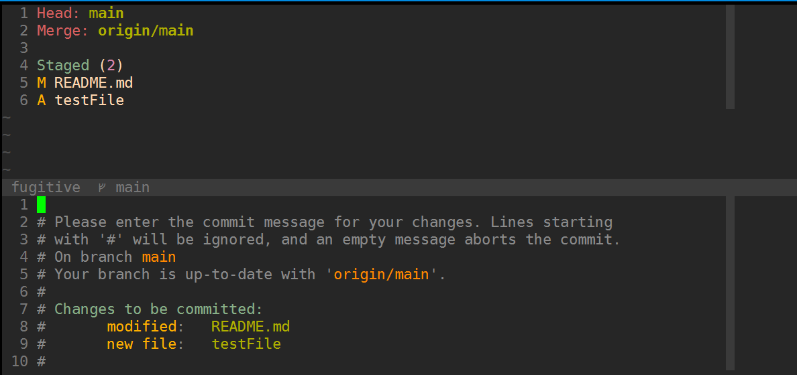
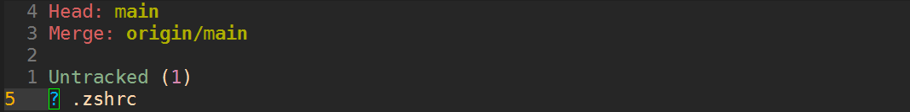
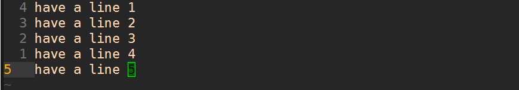

## Making Vim Amazing

Making Vim Amazing - Why use Vim and the .vimrc - Part 1

https://www.youtube.com/watch?v=Iid1Ms14Om4


特点

1. 打开速度快

2. 自动补全

3. 跳转到定义 

   快速跳转，文件树到编辑器 


插件管理器：vundle

补全：YCM

文件树：nerdtree

​	ctrl+w  ctrl+h           ctrl+w ctrl+L    ctrl用leader替代

文件查找：ctrlp  ag


前后跳转 ctrl+g ctrl+i


颜色主题：gruvbox

安装插件命令：PluginInstall     vimrc文件中增加 colorscheme gruvbox


## Vim Movements P1 - Your First Moves

1. 不要用方向键

2. 习惯HJKL B W

3. **用 f 和 t     f跳转到指定字符  t跳转到指定字符之前    %跳转到对应括号**

   举例：删除整段函数以及注释

   

   光标放到注释行，shift+v     j      f+{ 跳转到第一个左括号  最后按%跳转到对应括号 ，d删除

4. **双击[ ] 向上/向下跳转段落     单击{ } 跳转到上/下空行**   

   大概知道要找的东西在上方或下方，快速跳转的时候用。

5. **shift+p 向上粘贴**

6. **shift+u 小写转大写**

   举例： shift+v 选择本行，shift+u 使本行变成大写

   

   

7. **ctrl+a 数字+1**

   **光标放在数字上**，ctrl+a会使得数字+1

   

8. o 另起一行输入 shift+o 在上方另起一行输入

9. shift+a 到行尾插入


## Your first VimRC: How to setup your vim's vimrc

https://www.youtube.com/watch?v=n9k9scbTuvQ

1. Getting started with sets
2. Plugin Manager
3. Plugins
4. remaps

可能遇到的问题：

```
https://blog.csdn.net/hunter___/article/details/105712003
```

### [前提]

python3.6以上 

```shell
sudo add-apt-repository ppa:deadsnakes/ppa
sudo apt update
sudo apt install python3.6 python3.6-dev -y
```

ppa太慢的问题：国内ppa源 反向代理

https://lug.ustc.edu.cn/wiki/mirrors/help/revproxy/

https://learnku.com/articles/6018/homemade-ppa-accelerated-mirror-image

每个ppa都会在/etc/apt/sources.list.d 目录下创建一个list文件。

只需要将其中的`http://ppa.launchpad.net`替换为`https://launchpad.proxy.ustclug.org`就行。

**注意是https**

然后sudo apt update


编译vim的python版本必须和编译YCM的一致。

其中--with-python3-config-dir指的是python3.6-config --configdir返回的值

```
# 1. install dependencies
sudo apt install libncurses5-dev libgnome2-dev libgnomeui-dev \
    libgtk2.0-dev libatk1.0-dev libbonoboui2-dev \
    libcairo2-dev libx11-dev libxpm-dev libxt-dev python-dev \
    python3-dev ruby-dev lua5.1 lua5.1-dev libperl-dev git
    
# 2. remove vim 
sudo apt remove vim vim-runtime gvim
sudo apt remove vim-tiny vim-common vim-gui-common vim-nox


# if pyenv is installed, set the python command to point at the system python with:
# pyenv shell system

# 3. configure 
# 如果提示checking if compile and link flags for Python 3 are sane... no
# 检查with-python3-config-dir，选择自己的python路径，重新clone一份vim源码再编译
cd ~
git clone https://github.com/vim/vim.git
cd vim
./configure --with-features=huge \
            --enable-multibyte \
            --enable-rubyinterp=yes \
            --enable-python3interp=yes \
            --with-python3-command=python3.6 \
            --with-python3-config-dir=/usr/lib/python3.6/config-3.6m-x86_64-linux-gnu \
            --enable-perlinterp=yes \
            --enable-luainterp=yes \
            --enable-gui=gtk2 \
            --enable-cscope \
	   	    --prefix=/usr/local
	   
make VIMRUNTIMEDIR=/usr/local/share/vim/vim82

# 4. use make to install
cd ~/vim
sudo make install

# 5. Set vim as your default editor with update-alternatives.

sudo update-alternatives --install /usr/bin/editor editor /usr/local/bin/vim 1
sudo update-alternatives --set editor /usr/local/bin/vim
sudo update-alternatives --install /usr/bin/vi vi /usr/local/bin/vim 1
sudo update-alternatives --set vi /usr/local/bin/vim
```

### [设置Vim]

0. #### vim配置恢复原状：

```shell
rm -rf ~/.vim

rm ~/.vimrc
```

修改Vim配置：

1. 创建.vimrc

   vim ~/.vimrc

2. 写入.vimrc

   ```.vimrc
   " 设置256色终端
   set t_Co=256
   " 基础高亮
   syntax on
   " 取消音效
   set noerrorbells
   set tabstop=4 softtabstop=4
   " shift > 组合键的宽度
   set shiftwidth=4
   " tab到空格键的转换
   set expandtab
   " 智能缩进
   set smartindent
   set nu
   " 取消自动换行
   set nowrap
   set smartcase
   " 不生成vim.swap文件
   set noswapfile
   " 设置备份文件夹(需要自己创建该文件夹)
   set nobackup
   set undodir=~/.vim/undodir
   set undofile
   " 即时得到结果
   set incsearch
   
   set colorcolumn=80
   highlight ColorColumn ctermbg=0 guibg=lightgrey
   ```

3. 编辑完成后应用修改  :source %

4. 创建~/.vim/undodir

   mkdir ~/.vim/undodir -p    (-p表示递归创建)

5. 安装插件

   1. vim-plug

      ```shell
      curl -fLo ~/.vim/autoload/plug.vim --create-dirs \
          https://raw.githubusercontent.com/junegunn/vim-plug/master/plug.vim
      ```

      

      如果遇到连接问题：

      curl: (7) Failed to connect to raw.githubusercontent.com port 443: Connection refused 

      修改一下hosts：

      ```
      sudo vim /etc/hosts
      末尾增加一行：199.232.68.133 raw.githubusercontent.com
      ```

   2. .vimrc中增加：

      ```
      call plug#begin('~/.vim/plugged')
      
      " 色彩主题
      Plug 'morhetz/gruvbox'
      " 快速grep
      Plug 'jremmen/vim-ripgrep'
      " git相关
      Plug 'tpope/vim-fugitive'
      " ts着色/格式
      Plug 'leafgarland/typescript-vim'
      " 查看文档
      Plug 'vim-utils/vim-man'
      " c++ rtags
      Plug 'lyuts/vim-rtags'
      " 搜索  Plug 'git@github:ctrlpvim/ctrlp.vim.git'，若安装失败则用下一行语句
      Plug 'https://github.com/ctrlpvim/ctrlp.vim.git'
      " 补全 Plug 'git@github:ycm-core/YouCompleteMe.git'，若安装失败则用下一行语句
      Plug 'https://github.com/ycm-core/YouCompleteMe.git'
      " 撤销修改
      Plug 'mbbill/undotree'
      
      call plug#end()
      ```

      在两个call语句之间增加插件

      

   3. Reload .vimrc（:source %） and `:PlugInstall` to install plugins.   安装完毕：

   

   

   如果遇到YCM和ctrlp安装失败：

   ```
   And if neither are working, it might be because your git is not configured for ssl. You could try https.
             Plug 'https://github.com/ctrlpvim/ctrlp.vim.git'
             Plug 'https://github.com/ycm-core/YouCompleteMe.git'
   ```

   

6. 设置主题及其他

   ```.vimrc
   " .vimrc
   " 颜色主题
   colorscheme gruvbox                                                             
   set background=dark 
   
   " git搜索
   if executable('rg')
   	let g:rg_derive_root='true'
   endif
   
   " 设置ctrlp不想搜索的文件
   let g:ctrlp_user_command = ['.git/','git --git-dir=%s/.git ls-files -oc --exclude-standard']
   " leader key 进入你的命令模式
   let mapleader = " "
   " 文件树
   let g:netrw_browse_split=2
   let g:netrw_banner = 0
   let g:netrw_winsize = 25
   
   " ag is fast enough that CtrlP doesn't need to cache "
   let g:ctrlp_use_caching = 0
   
   ```

   注意如果颜色不对，检查是否设置了256色终端

   ```
   " 设置256色终端
   set t_Co=256
   ```

   设置成功后的样式：

   

7. **安装YCM**

   需要python3.6以上  需要cmake和python-dev

   ```
   #安装依赖：clang,cmake,python3.X-dev(X根据python版本而定)   
   sudo apt install clang cmake python3.6-dev
   
   # Compiling YCM with semantic support for C-family languages through clangd:
   cd ~/.vim/plugged/YouCompleteMe/
   python3 install.py --clangd-completer
   ```

   完成安装

   

   进入vim，不报错就说明YCM安装好了。

   进入vim，如果遇到以下问题：重新编译Vim

   

   注意 --with-python3-config-dir 这个编译参数，对应的是3.6版本以上的python config路径。以python3.6为例，--with-python3-config-dir指的是python3.6-config --configdir这条shell指令返回的值。

8. 实现跳转到定义

   光标放在函数或类上，使用`:YcmCompleter GoTo`可以跳转到定义处，但是做一个映射显然更方便

   `<ctrl-w> `后续跟h或l，可以在窗口之间左右跳转

   `:Ex`命令可以浏览当前文件夹中的文件列表

   `:vs` `:sp`两种分割窗口的模式

   `:vertical resize 30 `设置当前窗口宽度（例中为左侧窗口）

   

   

   所以来重新编辑vimrc：

   文本搜索功能需要额外安装ripgrep

   ```shell
   curl -LO https://github.com/BurntSushi/ripgrep/releases/download/11.0.2/ripgrep_11.0.2_amd64.deb
   # 注意这里的文件名以下载的文件名为准
   sudo dpkg -i ripgrep_11.0.2_amd64.deb
   ```

   使用示例：

   空格+ps调出搜索功能，:Rg "new *WS" 回车    会搜索出系统里所有符合的文本文件。

   

   修改vimrc：

   <**silent**> tells **vim** to show no message when this key sequence is used. 

   ```
   " remaps
   
   " leader+h/l 左右窗口跳转
   nnoremap <leader>h :wincmd h<CR>
   nnoremap <leader>j :wincmd j<CR>
   nnoremap <leader>k :wincmd k<CR>
   nnoremap <leader>l :wincmd l<CR>
   " undotree 历史操作
   nnoremap <leader>u :UndotreeShow<CR>
   " 分割出新窗口,显示之前的工作目录
   nnoremap <leader>pv :wincmd v<bar> :Ex <bar> :vertical resize 30<CR>
   " 文本搜索 需要安装ripgrep
   nnoremap <Leader>ps :Rg<SPACE>
   nnoremap <slient> <Leader>+ :vertical resize +5<CR>
   nnoremap <slient> <Leader>- :vertical resize -5<CR>
   
   " YCM 
   " The best part.
   " leader+gd 跳转到定义
   nnoremap <slient> <Leader>gd :YcmCompleter GoTo<CR>
   nnoremap <slient> <Leader>gf :YcmCompleter FixIt<CR>
   ```

   

9. 最终的.vimrc文件

   ```.vimrc
   "~/.vimrc  Version 0.1 By Cells
   " 设置256色终端
   set t_Co=256
   " 基础高亮
   syntax on
   " 取消音效
   set noerrorbells
   set tabstop=4 softtabstop=4
   " shift > 组合键的宽度
   set shiftwidth=4
   " tab到空格键的转换
   set expandtab
   " 智能缩进
   set smartindent
   set nu
   " 取消自动换行
   set nowrap
   set smartcase
   " 不生成vim.swap文件
   set noswapfile
   " 设置备份文件夹(需要自己创建该文件夹)
   set nobackup
   set undodir=~/.vim/undodir
   set undofile
   " 即时得到结果
   set incsearch
   
   set colorcolumn=80
   highlight ColorColumn ctermbg=0 guibg=lightgrey
   
   call plug#begin('~/.vim/plugged')
   
   " 色彩主题
   Plug 'morhetz/gruvbox'
   " 快速grep
   Plug 'jremmen/vim-ripgrep'
   " git相关
   Plug 'tpope/vim-fugitive'
   " ts着色/格式
   Plug 'leafgarland/typescript-vim'
   " 查看文档
   Plug 'vim-utils/vim-man'
   " c++ rtags
   Plug 'lyuts/vim-rtags'
   " 搜索  Plug 'git@github:ctrlpvim/ctrlp.vim.git'，若安装失败则用下一行语句
   Plug 'https://github.com/ctrlpvim/ctrlp.vim.git'
   " 补全 Plug 'git@github:ycm-core/YouCompleteMe.git'，若安装失败则用下一行语句
   Plug 'https://github.com/ycm-core/YouCompleteMe.git'
   " 撤销修改
   Plug 'mbbill/undotree'
   
   call plug#end()
   
   " 颜色主题
   colorscheme gruvbox                                                             
   set background=dark 
   
   " git搜索
   if executable('rg')
       let g:rg_derive_root='true'
   endif
   
   " 设置ctrlp不想搜索的文件
   let g:ctrlp_user_command = ['.git/','git --git-dir=%s/.git ls-files -oc --exclude-standard']
   " leader key 进入你的命令模式
   let mapleader = " "
   " 文件树
   let g:netrw_browse_split=2
   let g:netrw_banner = 0
   let g:netrw_winsize = 25
   
   " ag is fast enough that CtrlP doesn't need to cache "
   let g:ctrlp_use_caching = 0
   
   " remaps
   
   " leader+h/l 左右窗口跳转
   nnoremap <leader>h :wincmd h<CR>
   nnoremap <leader>j :wincmd j<CR>
   nnoremap <leader>k :wincmd k<CR>
   nnoremap <leader>l :wincmd l<CR>
   " undotree
   nnoremap <leader>u :UndotreeShow<CR>
   " 分割出新窗口,显示之前的工作目录
   nnoremap <leader>pv :wincmd v<bar> :Ex <bar> :vertical resize 30<CR>
   " 文本搜索 需要安装ripgrep
   nnoremap <Leader>ps :Rg<SPACE>
   nnoremap <silent> <Leader>+ :vertical resize +5<CR>
   nnoremap <silent> <Leader>- :vertical resize -5<CR>
   
   " YCM 
   " The best part.
   " leader+gd 跳转到定义
   nnoremap <silent> <Leader>gd :YcmCompleter GoTo<CR>
   nnoremap <slient> <Leader>gf :YcmCompleter FixIt<CR>
   ```

   

## VIM Movements P2: 5 moves to make you better ked

https://www.youtube.com/watch?v=QN4fuSsWTbA

5 movements to step up your vim game.  Yes your vim game.  I have seen it.  Its a bit weak.  I see you have been skipping leg day, every day.  Stop it. 


1. 用ctrl+[ 来代替Esc
2. 不需要用caps lock映射到Esc
3. 特定键盘可以单手操作
4. f/t+搜索的字符   f定位到字符，t定位到字符前  **分号; 跳转到下一个匹配  逗号, 跳转到上一个匹配**
5. **对于要修改的函数，直接按cw就可以删除并跳出备选项**
6. **vi) 选中括号内的文字   va)选中括号以及括号内容** )改为] }也是同样的效果 删除同理 di)   ci)
7. **Mark：m+letter    跳转回书签 `+letter    大写的letter表示全局跳转  小写的表示文件内**  
8. **v+j/k选中区块，shift+j/k移动区块并格式化**

```.vimrc
" shift+k 移动区块并格式化                                                      
vnoremap J :m '>+1<CR>gv=gv                                                     
vnoremap K :m '<-2<CR>gv=gv 
```

gv表示重新高亮之前高亮过的代码

<CR> 'CR-used-for-NL,即表示新行的意思，可以使用 CRTL-V CRTL-M（输入du的是 <CR> 字符本身） 或者zhi '\r'，Vim 并不会在文件中直接输入 <CR> 字符，它会根据当前 ‘fileformat’ 的设置来决定使用<CR>（Mac），<NL>(\*nix) 还是 <CR><NL>(dos)。


here are another two nice motions: 文件跳转
**use `gi` to jump to your last insert location** 返回上次插入位置
**use `ctrl+^` to switch back and forth between your current and last file** 返回上次编辑的文件

类似的还有ctrl+i ctrl+o 跳转之前转到光标位置


## Using Vim: My Vim Workflow - Solving a bug

Vim debug工作流程

https://www.youtube.com/watch?v=-I1b8BINyEw

https://github.com/ThePrimeagen/vim-royale


新增fzf插件 模糊查询

https://github.com/junegunn/fzf

https://github.com/junegunn/fzf.vim


用fzf代替ctrlp

```
" fzf                                                                           
Plug 'junegunn/fzf', { 'do': { -> fzf#install() } }                             
Plug 'junegunn/fzf.vim'  

" fzf查找文件 使用时当前工作目录必须在git仓库中                                              
nnoremap <C-p> :GFiles<CR>  
```


leader+gd 跳转到定义

leader+gr 查找所有引用

```
nnoremap <silent> <Leader>gr :YcmCompleter GoToReferences<CR>
```

`ctrl+^` 跳转回上一次编辑的文件

在跳转引用时也显示预览窗口:`<leader>pw`


## Using Vim: Vim + Git - Fugitive Part 1 - Usage and Merge Conflicts

https://www.youtube.com/watch?v=PO6DxfGPQvw

https://github.com/tpope/vim-fugitive


```
" git相关                                                                       
Plug 'tpope/vim-fugitive' 
" airline 显示git等状态                                                                 
Plug 'https://github.com/vim-airline/vim-airline.git' 

" git                                                                           
nmap <leader>gh :diffget //3<CR>                                                
nmap <leader>gu :diffget //2<CR>
" 查看当前分支状态
nmap <leader>gs :G<CR>  
```


查看当前分支状态：

`<leader>gs`


光标移到文件对应行，按u表示不暂存，s表示暂存。或者到第四行的状态指示栏同时修改所有状态

:Gcommit 提交修改，回车后出现下面命令



增加必要的备注后保存退出，此时已经自动执行了commit，显示Unpushed


:Gpush 推送到repo，Unpushed消失，完成一次push。


#### 遇到merge conflict怎么办：

**创建conflict场景：**

checkout -b 一个新分支 `conflict_branch`，修改文件，提交并push。

checkout回主分支，修改同一个文件，提交并push。

#### **处理conflict：**

还是先查看当前分支状态：`<leader>gs` ，

这时执行`:Gmerge conflict_branch`  (等效： `git merge conflict_branch` )就需要**处理冲突**：

在分支窗口中，**光标移动到需要比较的文件上**（比如第五行），按`dv`： 效果如下

最左边窗口是当前分支，中间是merge结果，最右边是刚才merge的conflict_branch分支


光标移到冲突行，执行 `:diffget //2` 就会自动将本段冲突改为左边分支的状态， `:diffget //3` 则是改为右边分支的状态。快捷键如下：

```
nmap <leader>gu :diffget //2<CR>
nmap <leader>gh :diffget //3<CR>                                                
```

如果要手动修改，就直接改中间窗口。

修改完成之后只需保存并关闭窗口  TODO：一次性关闭所有窗口的`<C-w> <C-O>` 无效？ `!wqall`可以用吗？

再次进入分支状态窗口：


add需要的文件(在文件名一行按`a`)：


执行`:Gcommit` 第一行就能看见merge信息了：


保存，然后查看分支状态：已经是merge完，待push状态。


`:Gpush`之后就结束流程了。


选择快捷键也可以改成：  适合自己的键位 h代表左侧窗口，l代表右侧窗口，和hjkl的移动位置一致

```
nmap <leader>gh :diffget //2<CR>
nmap <leader>gl :diffget //3<CR>     
```


另附：图形化查看git分支提交记录，两种方式：

```shell
git log --graph --pretty=oneline --abbrev-commit # 显示简要信息
git log --graph # 显示所有信息
```


## Using Vim: Vim + Git Part 2: FzF and Fugitive

```
Plug 'stsewd/fzf-checkout.vim'

" fzf set                                               
let g:fzf_layout = {'window':{'width':0.8,'height':0.8}}
let $FZF_DEFAULT_OPTS='--reverse'     
" 弹出确认框
nnoremap <leader>gc :GCheckout<CR>                      
```

`<leader>gc`的效果：


`<C-d>` 删除选中分支

`<C-t>` track远程分支


#### 还是merge冲突的场景：

在某个文件上`shift+x` ,可以将提交内容完全修改为该文件的内容

完成后`s`保存

可以用`cc`代替`:Gcommit`

`:GlLog` 查看git log


#### 将文件加入gitignore：



光标放在文件上，输入`任意数字gI`：

就会自动将文件加入`.gitignore`文件内


## Vim Search and Replace

https://www.youtube.com/watch?v=q7gr6s8skt0

需要安装coc.nvim

```
" rename (具体效果取决于补全插件)                                                       
nmap <leader>rr <Plug>(coc-rename)                             
" search 搜索引用和定义                                                      
nnoremap <leader>prw :CocSearch <C-R>=expand("<cword>")<CR><CR>

" gruvbox配置
let g:gruvbox_contrast_dark = 'hard'
if exists('+termguicolors')
	let &t_8f = "\<Esc>[38;2;%lu;%lu;%lum"
	let &t_8b = "\<Esc>[48;2;%lu;%lu;%lum"
endif
let g:gruvbox_invert_selection='0'

```

<leader>prw  搜索定义和引用 也可以在左侧搜索结果中替换，达到重命名的目的


#### 项目范围的宏操作：

1. 录制宏

   **必须从文件头开始录制宏的原因：保证搜索结果的顺序，才能正确应用到每个文件上**

目的：删除第一行SIZE_OF_DATA，第七行的SIZE_OF_DATA改为t.size，再将第九行用条件包裹


完成后的样式：


2. 搜索`:CocSearch   import.*SIZE_OF -A 20`   -A 20表示显示搜索结果和接下去的20行 

   注意：CocSearch依赖Rg

3. 对指定项应用刚才录制的宏 `:%g/import.*SIZE_OF/norm! @a`

   


## Vim Registers: What, How, and Macros

https://www.youtube.com/watch?v=Q5eDxR7bU2k

Vim中的Registers就是键值对，值就是字符串。有一些隐式的Register，还有一些是可以显式设置的。

录制宏时，就是把一系列的文本放到寄存器里，这意味着你可以用`"`操作它。

`:reg`命令查看所有设置的寄存器

 复制一行文字，查看寄存器，会发现 "" 寄存器的内容变为复制的内容。这就是默认存储你在复制、删除时内容的寄存器。


如何改变存储位置：

选中要复制的内容，执行 `"ay`  这样就把内容复制到a寄存器里了


如果要使用a寄存器的内容：`"a+action`   比如 `"ap`

一些有用的默认寄存器内容：

`"%p` 粘贴当前文件名称，如果跳转到其他文件，这个命令还会打印相对路径

`"#p` 粘贴之前文件名称

`"_d` _寄存器是一个void register 在reg列表中不会看到它，**意味着删除的内容不会影响当前"剪切板"中的内容！**

```
vnoremap <leader>p "_dP
```

`<C-a>` 跳转到行尾

录制一个宏 b：复制当前行，并将光标移到行尾：

```
qb Vyp Ctrl+a q
```

这样"b寄存器中就有对应操作了。


`"bp`可以打印之前的按键 

`@b` 重复之前操作，**按多次的话不用 @b@b@b，之后一直按@@就可以代替@b**

`"by` 更新寄存器内容

#### 应用举例：

1. 录制一个宏 ，内容为 `Vyp^a`  （^a代表`<C-a>`）效果为复制当前行，并将行尾的数字加1：



2. 录制一个宏 ，内容为`_fldwj` 并使用： （ _到行首 找到第一个l 删除单词 跳转到下一行）`V"cy` 将这行复制到c寄存器中，按@c使用。


另附：录制宏

```
a. qa 开始将后续命令放入寄存器a中，q为开启寄存器，a表示寄存器名称
b. 执行需要进行处理的操作
c. q 结束记录操作
d. @a 执行寄存器操作
```

删除到行尾：D

改写到行尾：C


## 另附

1. 对vim进行纵向输入/纵向插入

   1. 按`ctrl + v`进入纵向编辑模式
   2. 使用方向键或 j k键 选中需要编辑的行
   3. 按`shift+ i`或`shitf+ a`进入插入模式(i是在当前字符前插入,a是在当前字符后插入)
   4. 输入需要键入的字符后或删除后,按`esc`退出.

2. 移动到行首非空字符时用 `0w` 命令比 `^` 命令更容易输入

3. 在空白行使用 `dip` 命令可以删除所有临近的空白行，`viw` 可以选择连续空白

4. 插入模式下，当你发现一个单词写错了，应该多用 `<C-w>` 这比 `<BackSpace>` 快

5. 写文章时，可以写一段代码块，然后选中后执行 `:!python` 代码块就会被替换成结果

   举例：输入 print(1+2) , V全选该行，输入 :`!python` 就会变成3

6. 搜索后经常使用 :nohl 来消除高亮，使用很频繁，可以 map 到 <BackSpace> 上

7. 映射按键时，应该默认使用 noremap ，只有特别需要的时候使用 map

8. 某些情况下 Vim 绘制高亮慢，滚屏刷新慢可以试试 set re=1 使用老的正则引擎

9. 


