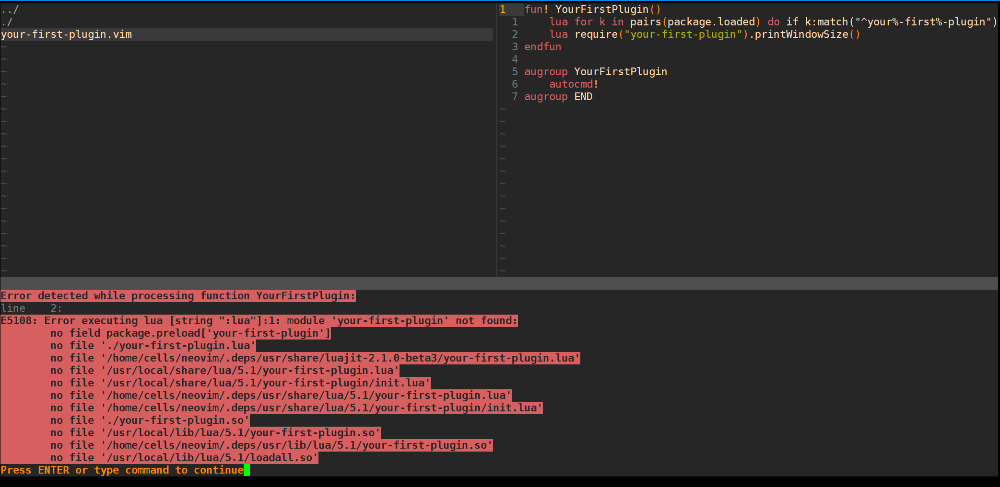
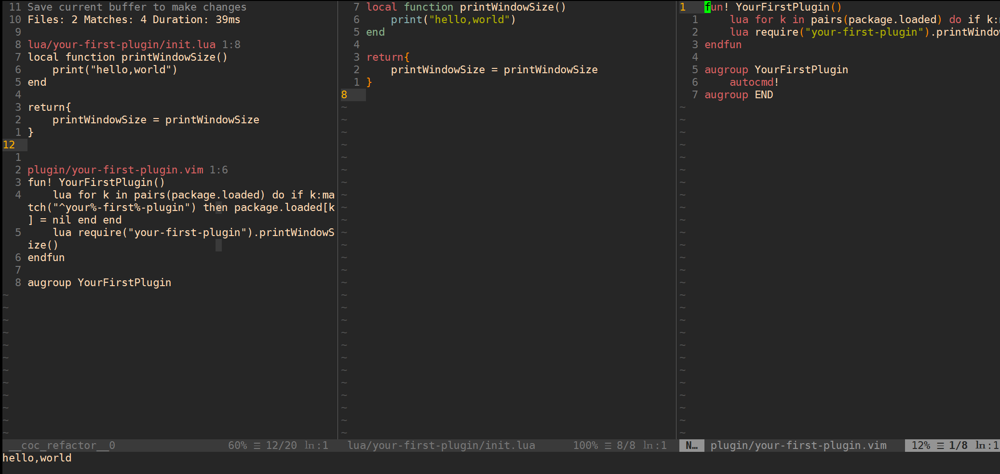
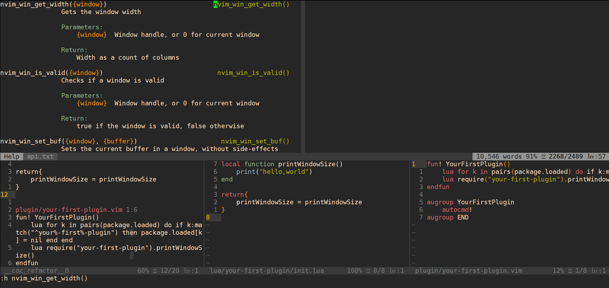
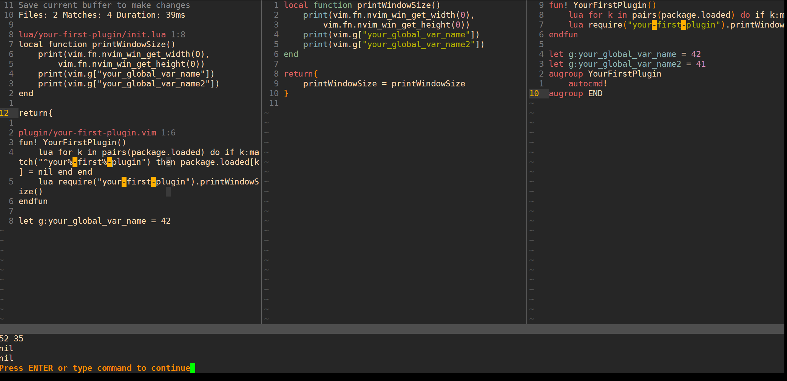
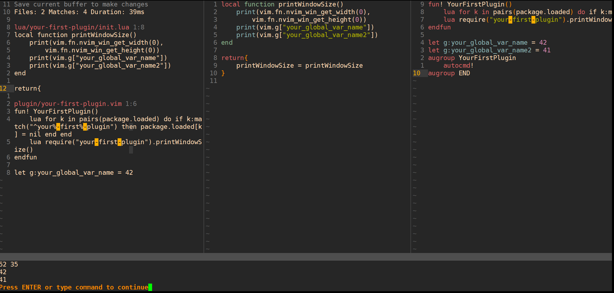
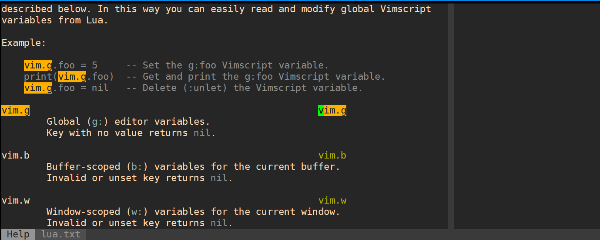
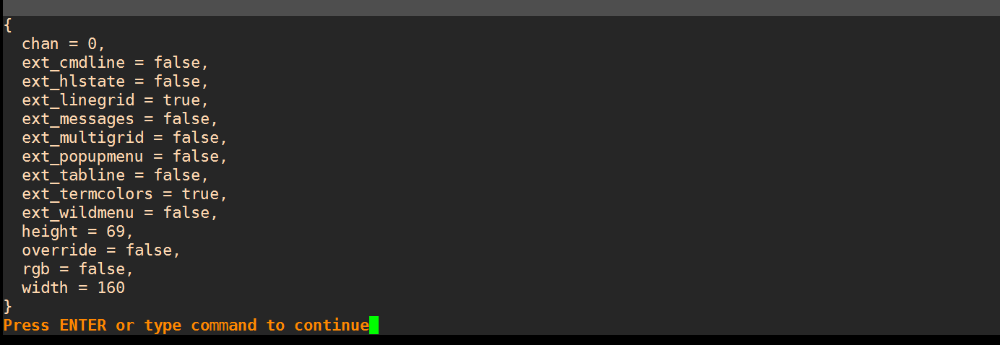
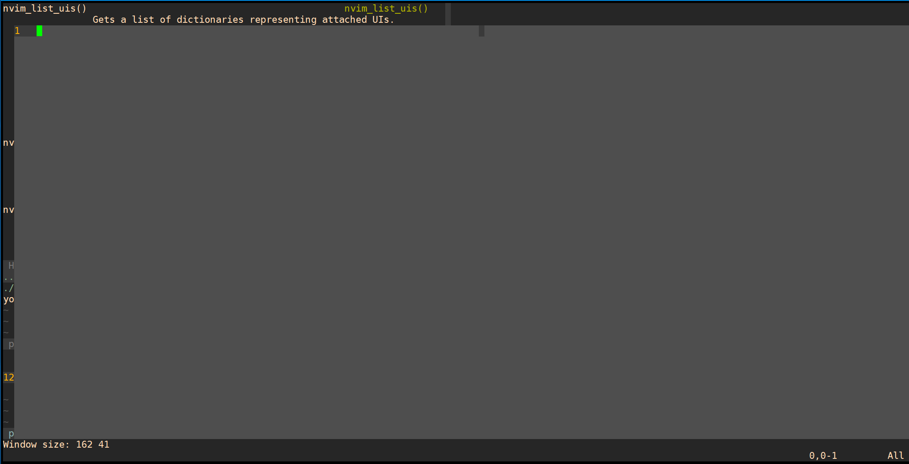

## Writing NeoVim Plugins Part 1 / 3

https://www.youtube.com/watch?v=9L4sW047oow

第一个插件：

#### 用lua写一个插件，显示当前窗口的长宽。

**启动方式**：`nvim --cmd "set rtp+=$(pwd)" .` 

这样可以source插件文件夹和lua文件夹 [?]

```lua
-- 文件目录：
-- main （项目根目录 暂且叫做FirstNvimPlugin）
-- |- README.md
-- |- plugin
--      |--your-first-plugin.vim
-- |- lua
--      |-your-first-plugin
-- 			|- init.lua

-- your-first-plugin.vim 
-- 这个function在每次被source时都会执行
fun! YourFirstPlugin()
	-- 这个语句非常重要  在loaded列表中删除我们的插件，这样下次调用时又会重新执行该函数，确保窗口有改动时，数据会立即刷新
	lua for k in pairs(package.loaded) do if k:match("^your%-first%-plugin") then package.loaded[k] = nil end end
    lua require("your-first-plugin").printWindowSize()                          
endfun  
-- 暂时没有其他功能 只是保证被source时刷新 
augroup YourFirstPlugin                                                         
    autocmd!                                                                    
augroup END                                                                     
```

执行 `:call YourFirstPlugin()` 会发现一堆报错：提示不是一个lua模块



在项目根目录下增加新文件夹 lua （到左侧项目窗口按`d`是新建文件夹  `R`是重命名 `%`是新建文件）

在新的lua文件夹中要有package的名称**文件夹**，所以再新建一个： `your-first-plugin`

在 `your-first-plugin`**文件夹**中新建一个`init.lua`**文件**

```lua
-- 还可以在最顶部加入 print语句来确保这个模块被执行
local function printWindowSize()     
    print("hello,world")
end                                  
                                     
return{                              
    printWindowSize = printWindowSize
}                                    
```

== 自动排版快捷键

完成后，输入 `:call YourFirstPlugin()` 就可以看到hello,world显示了



接下来要实现提示窗口尺寸功能：

`:h nvim` 获得提示信息，猜测一下 :h nvim_wi 然后tab补全，查看函数列表：



得到帮助文档之后，修改init.lua：

```lua
local function printWindowSize()   
    -- 参数0表示当前窗口
    print(vim.fn.nvim_win_get_width(0),
        vim.fn.nvim_win_get_height(0)) 
end                                    
                                       
return{                                
    printWindowSize = printWindowSize  
}                                      
```

输入 `:call YourFirstPlugin()` 就可以看到结果了


#### 如何获取.vimrc中的值：

`vim.g`   

举例：`print(vim.g["your-global-var-name"])`

如果显示nil 说明没有重新source文件，记住 我们现在只是清除了lua文件的cache，没有清除vim的cache。



到插件文件中，执行`:so %`  就能正常显示了




### 如何获取帮助？

`:h vim.` 然后搜索关键词




## NeoVim Plugin 2 / 3 - Windows and Buffers!!!

复习/重构代码：

```lua
fun! YourFirstPlugin()
    lua for k in pairs(package.loaded) do if k:match("^your%-first%-plugin") then package.loaded[k] = nil end end
    lua require("your-first-plugin").createFloatingWindow()
endfun                                                                                  
augroup YourFirstPlugin
    autocmd!  
augroup END                  
```

```lua
local function createFloatingWindow()           
    local width = vim.fn.nvim_win_get_width(0)  
    local height = vim.fn.nvim_win_get_height(0)
                                                
    print("Window size:",width,height)          
end                                             
                                                
return{                                         
    createFloatingWindow = createFloatingWindow 
}                                               
```

同样，修改完代码要source vim文件 `:so %`

如果报错，检查自己nvim当前的pwd，是否在项目根目录下执行`nvim --cmd "set rtp+=$(pwd)" .` 


### 创建悬浮窗口：

需要知道两件事： 创建buffer   创建window

buffer支持各种文字操作，window显示内容。

还是通过 `:h`  查看用法   `:messages`查看输出的所有结果

可以用`:lua print(vim.api.nvim_list_uis()[1])` 这种方式来测试结果, 返回一个table 不是我们想要的具体参数，所以用`:lua print(vim.inspect(vim.api.nvim_list_uis()[1]))` 解包参数

**特别注意lua的列表第一个下标是1而不是0！**




```vim
fun! YourFirstPlugin()
    lua for k in pairs(package.loaded) do if k:match("^your%-first%-plugin") then package.loaded[k] = nil end end
    lua require("your-first-plugin").createFloatingWindow()
endfun

augroup YourFirstPlugin
    autocmd!
    " 每次窗口大小发生变化时执行onResize()函数
    autocmd VimResized * :lua require("your-first-plugin").onResize()
augroup END
```

```lua
local function createFloatingWindow()
    local stats = vim.api.nvim_list_uis()[1]
    local width = stats.width
    local height = stats.height

    print("Window size:",width,height)
    
    -- version 1 not good
    -- create buffer handler 
    local bufh = vim.api.nvim_create_buf(false,true)
    local winId = vim.api.nvim_open_win(bufh,true,{
        relative="editor",
        width = width - 2,
        height = height -4,
        col = 2,
        row = 2,
    })
end

local function onResize()
    local stats = vim.api.nvim_list_uis()[1]
    local width = stats.width
    local height = stats.height

    print("Window size from onResize():",width,height)
end
    

return{
    createFloatingWindow = createFloatingWindow,
    onResize = onResize
}
```

完成后的效果：



### 