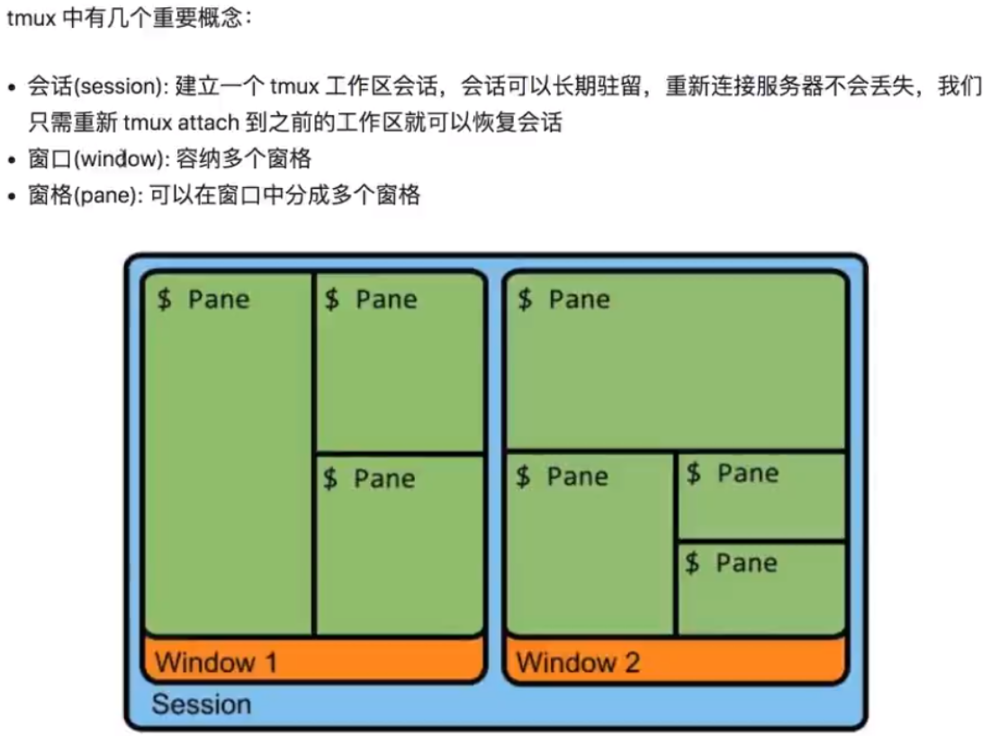
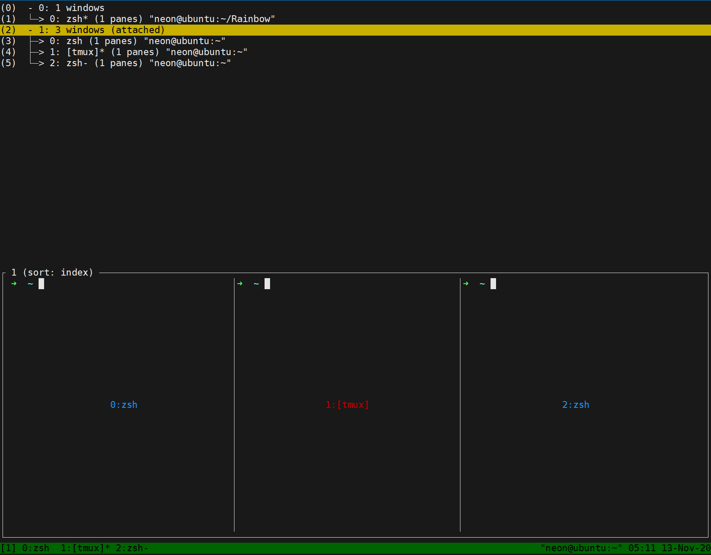
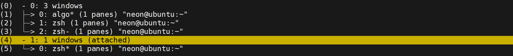
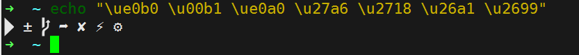
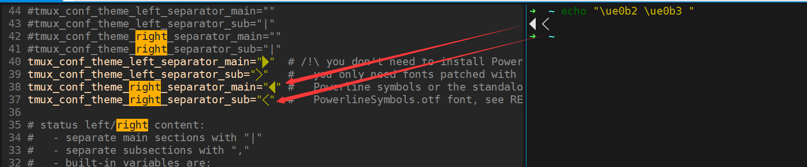
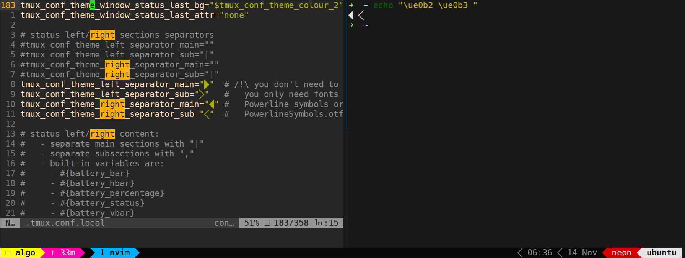
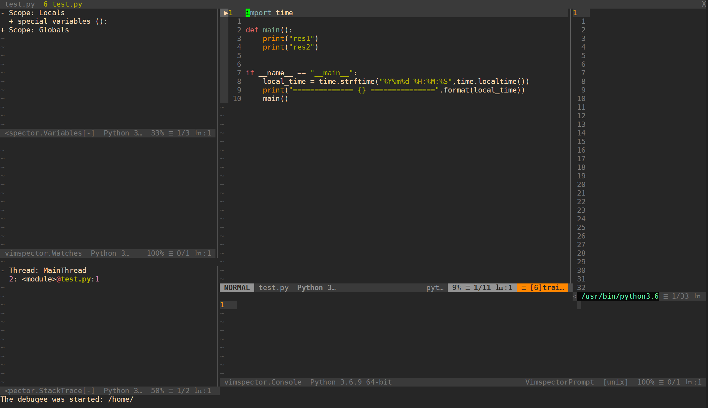
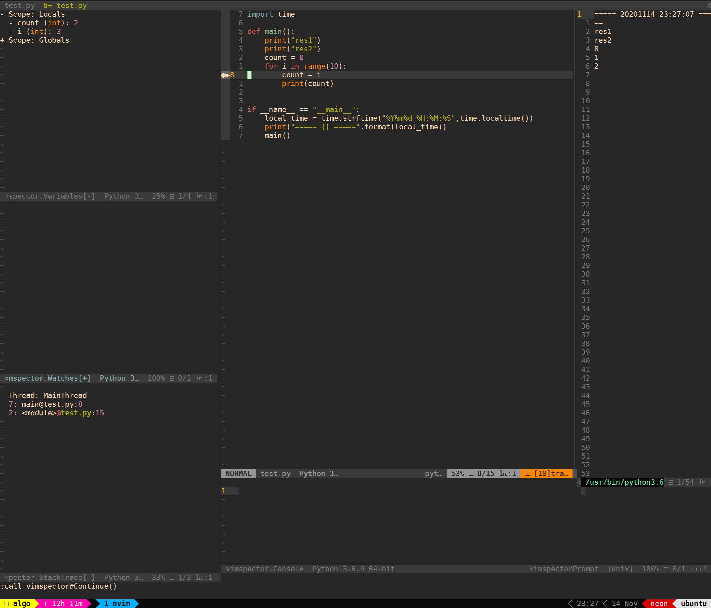

## Tech Weekly #1  NeoVim Terminal

https://www.youtube.com/watch?v=8m5t9VDAqDE&t=205s

`:terminal` 进入neovim终端，`i`**进入插入模式**，就可以操作终端了

`<C-d>` 退出终端

`<C-\><C-n>` 只退出插入模式 不退出终端


**TODO**

跳转到错误文件的指定行 [3:00]

把vim代码 “发射”到命令行


## Tech Weekly #2 : Tmux + i3 + Vi Mode!

https://www.youtube.com/watch?v=cV7USzll584

https://github.com/awesome-streamers/awesome-streamerrc/blob/master/ThePrimeagen/tmux

1. #### 安装Tmux

   https://github.com/tmux/tmux/wiki/Getting-Started

   ```shell
   sudo apt install tmux
   ```

   `tmux -V` 查看版本

   一些概念：

   

2. #### 使用

   输入 `tmux` 进入新的窗口

    tmux有一个前缀命令是`<C-b>`，作者设置成了`<C-a> `  

   ```
   # ~/.tmux.conf
   # prefix change
   unbind C-b
   set-option -g prefix C-a
   bind-key C-a send-prefix
   
   set -g base-index 1
   
   # vi mode 复制命令行内容、vi操作窗口
   set-window-option -g mode-keys vi
   bind-key -T copy-mode-vi v send-keys -X begin-selection
   bind -T copy-mode-vi y send-keys -X copy-pipe-and-cancel 'xclip -in -selection clipboard'
   
   # vim-like pane switching（prefix+HJKL切换窗口）
   bind -r k select-pane -U
   bind -r j select-pane -D
   bind -r h select-pane -L
   bind -r l select-pane -R
   ```

   `<C-a> c` 创建新窗口

   `<C-a> &` 关闭当前窗口

   `<C-a> n` 到上一个窗口

   `<C-a> p` 到下一个 窗口

   `<C-a> number` 到第n个窗口

   `<C-a> ，` 重命名当前窗口

   `<C-a> w` 预览所有会话(session)和窗口:

   

   `<C-a> d` detach from session（退出tmux会话）

   脱离之后再创建一个tmux new，就可以看到不同的两个session：

   

   `tmux ls`  列出所有session

   `tmux new [-name]` 创建新session

   `tmux a -t 1` attach到session1

   `tmux kill-session` 关闭session

   

   `<C-a> "` — 水平分割pane。

   `<C-a> % `竖直分割pane。

   `<C-a> 方向键`选择pane。

   `<C-a> x` 关闭当前pane

   `<C-a> 方向键` 调整当前pane大小

3. #### 一些工作区预设

   [5:30] TODO

4. #### **复制命令行中的内容**

   `<C-a> [` 就可以用vim的方式操作之前显示的命令行内容（无法复制  TODO）

   `<C-a> [？` 可以搜索之前命令行内容 √


另附：安装ohmytmux

https://github.com/gpakosz/.tmux

```shell
# 需要PowerlineSymbols字体支持
# https://github.com/powerline/powerline/blob/develop/font/PowerlineSymbols.otf
cd ~
git clone https://github.com/gpakosz/.tmux.git
ln -s -f .tmux/.tmux.conf
cp .tmux/.tmux.conf.local .
```

解决powerline符号显示问题：安装PowerlineSymbols.otf

https://github.com/gpakosz/.tmux#enabling-the-powerline-look

先测试是否安装了相关符号文件：

```
echo "\ue0b0 \u00b1 \ue0a0 \u27a6 \u2718 \u26a1 \u2699"
```



如果能正常显示符号，但左右分隔符还是错误：

echo对应的分隔符，在终端中直接复制，粘贴到 .tmux.conf.local文件对应行：



重启tmux，就正常显示了：




参考：https://www.jianshu.com/p/94629150d422


## Tech Weekly #3 : Debugging In Vim

debug插件和窗口最大化插件

```
" graphical debugger          
Plug 'puremourning/vimspector'
" maximizer window            
Plug 'szw/vim-maximizer'      
```

`:MaximizerToggle`最大化当前窗口，再执行一次恢复原比例


在项目中创建`.vimspector.json` 文件，配置debugger

具体设置参照：https://github.com/microsoft/debugpy/wiki/Debug-configuration-settings

```json
{
  "configurations": {
    "<name>: Launch": {
      "adapter": "debugpy",
      "configuration": {
        "name": "<name>: Launch",
        "type": "python",
        "request": "launch",
        "cwd": "<working directory>",
        "python": "/path/to/python/interpreter/to/use",
        "stopOnEntry": true,
        "console": "externalTerminal",
        "debugOptions": [],
        "program": "<path to main python file>"
      }
    }
    ...
  }
}
```

`:VimspectorInstall debugpy `安装debugger所需的adapter

`:call vimspector#Launch()` 运行debugger，选择异常处理方式后进入debug界面。



左上角窗口显示作用域和变量

左边中部窗口显示变量监视

左下角显示调用栈

右下角底部窗口可以执行命令查看结果。例如 main()

右上角窗口显示程序输出内容


`:call vimspector#` 补全 查看更多命令。插件本身没有设置按键映射，所以单步、进入函数等功能要自己映射按键。

```vim
" init.vim
" vim-maximizer
nnoremap <leader>m :MaximizerToggle!<CR>
fun! GotoWindow(id)
    call win_gotoid(a:id)
    MaximizerToggle
endfun
" Debugger remaps from vimspector
" 启动debugger
nnoremap <leader>dd :call vimspector#Launch()<CR>
" 各种窗口的跳转
nnoremap <leader>dc :call GotoWindow(g:vimspector_session_windows.code)<CR>
nnoremap <leader>dt :call GotoWindow(g:vimspector_session_windows.tagpage)<CR>
nnoremap <leader>dv :call GotoWindow(g:vimspector_session_windows.variables)<CR>
nnoremap <leader>dw :call GotoWindow(g:vimspector_session_windows.watches)<CR>
nnoremap <leader>ds :call GotoWindow(g:vimspector_session_windows.stack_trace)<CR>
nnoremap <leader>do :call GotoWindow(g:vimspector_session_windows.output)<CR>
" 退出debugger
nnoremap <leader>de :call vimspector#Reset()<CR>
" 无法使用 待验证
nnoremap <leader>dtcb :call vimspector#CleanLineBreakpoint()<CR>

" 单步调试
nmap <leader>dl <Plug>VimspectorStepInto
nmap <leader>dj <Plug>VimspectorStepOver
nmap <leader>dk <Plug>VimspectorStepOut
nmap <leader>d_ <Plug>VimspectorRestart
" 运行，直到结束或遇到断点
nnoremap <leader>d<space> :call vimspector#Continue()<CR>

" 运行到光标处
nmap <leader>drc <Plug>VimspectorRunToCursor
" 增加断点 再执行一次取消当前行断点
nmap <leader>dbp <Plug>VimspectorToggleBreakpoint
" 条件断点
nmap <leader>dcbp <Plug>VimspectorToggleConditionalBreakpoint
```


条件断点 `<leader>dcbp`在使用时需要输入两个参数

1. 条件表达式 比如 count==2

2. hit count表达式  可以填0

   这样就实现了count等于2时触发断点

