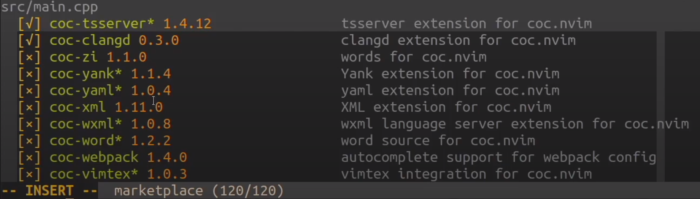
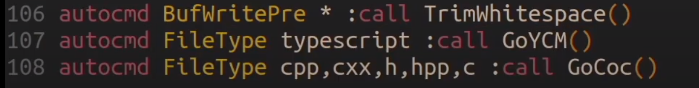
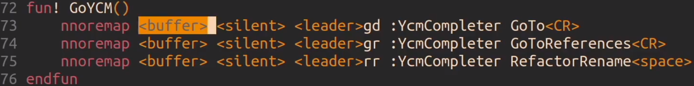
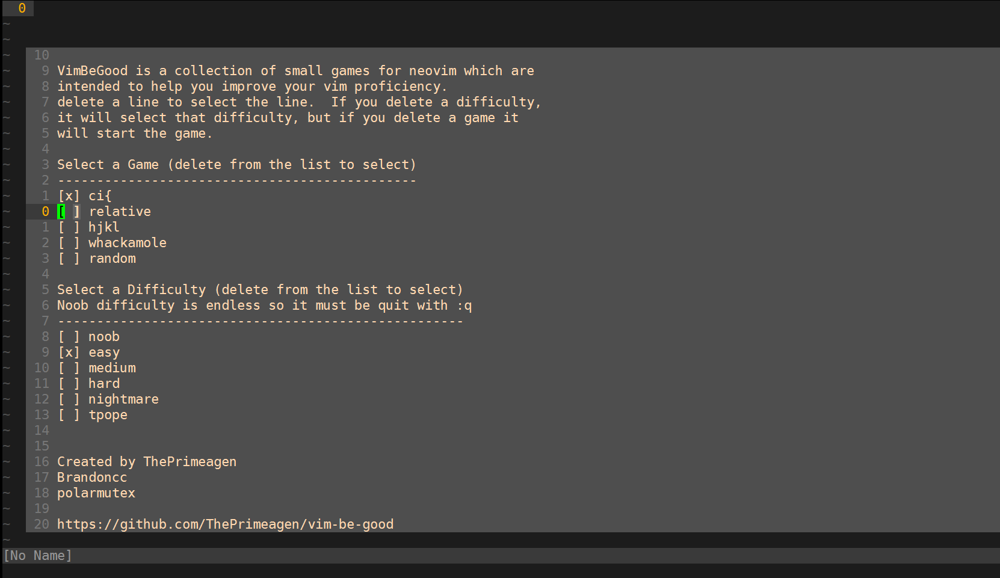
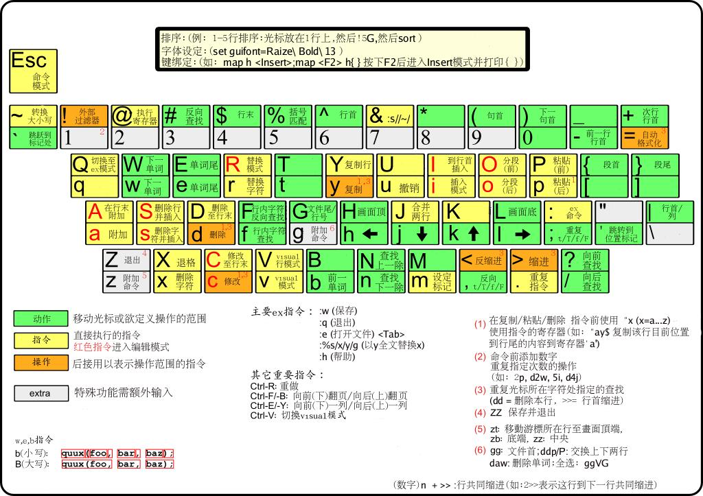
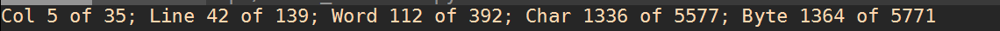
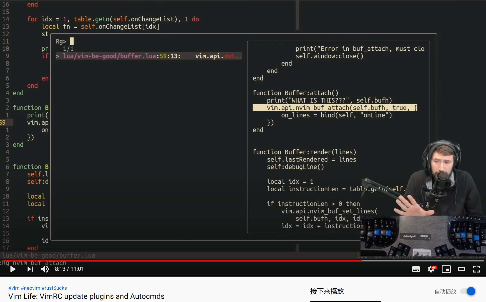

## Vim Life Ep1: CoC vs YCM

https://www.youtube.com/watch?v=ICU9OEsNiRA

https://github.com/neoclide/coc.nvim

Conquer of completion

在 C++补全方面更好 安装更方便，可以选择特定的补全模块：`:CocList marketplace`



对不同的文件选用不同的补全插件



<buffer>：确保键盘映射只对当前缓冲区生效

You can define mappings specific to the current buffer by using the keyword "<buffer>" in the map command.



Vim8.2 版的 Vimscript 编程指南

http://vimcdoc.sourceforge.net/doc/usr_41.html

VimL 语言编程指北路

https://github.com/lymslive/vimllearn

## Vim Life Ep 2 - Macros, Motivation for getting good!

https://www.youtube.com/watch?v=Wf5cMON6vS4

"I hopefully that just inspires you to do this."

**注意：录制宏时，定位操作最好使用/搜索，HJKL 操作如果移动到代码块之外，使用宏时会遇到意外的问题。**

使用宏的三步走：

1. Start q+宏名称
2. DO IT 执行操作
3. Stop 再次按 q 退出录制
4. Play @+宏名称 应用宏

举例：要对两个代码块完成相同的操作：格式化、改函数、加参数

```cpp
namespace JSC{
#ifdef HEAP_ALLOC_TRACING
if(JSC::Options::heapSampling){
    JSGlobalData& globalData = exec->globalData();
    globalData.recordHeapSample(activation->cost(globalData),"Activation");
}
#endif
#ifdef HEAP_ALLOC_TRACING
if(JSC::Options::heapSampling){
    JSGlobalData& globalData = exec->globalData();
    globalData.recordHeapSample(activation->cost(globalData),"Activation");
}
#endif
}

```

1. 光标放在第二行，**按 q 进入记录模式 ，按一个键(此处为 j)为这个宏命名**

   

2. shift v

3. /endif

4. = 格式化代码，并把光标放到代码块头部，这一步完成代码块格式化。

5. /JSC

6. dt+O 删除 JSC 这个单词

7. heapSampling 修改为 logAllocations()

8. recordHeapSample 修改为 recordHeapAllocation

9. 加一个 activation 参数

10. **再次按 q 退出宏** 左下角记录中的状态就没有了

11. 光标放在第二个#ifdef 处，输入**@j**，就可以对第二段代码执行宏了,修改完的代码如下：

```cpp
namespace JSC{
#ifdef HEAP_ALLOC_TRACING
        if(Options::logAllocations()){
                JSGlobalData& globalData = exec->globalData();
                globalData.recordHeapAllocation(activation,activation->cost(globalData),"Activation");
        }
#endif
#ifdef HEAP_ALLOC_TRACING
        if(Options::logAllocations()){
                JSGlobalData& globalData = exec->globalData();
                globalData.recordHeapAllocation(activation,activation->cost(globalData),"Activation");
        }
#endif
}

```

### Vim Life Ep 3: Vimium : Intro to using keyboard in your browser

https://www.youtube.com/watch?v=cA2aUFsSLac

https://www.zhihu.com/question/23483616

在 Chrome 中使用 vim

将焦点聚集在第一个输入框 gi (2gi 就是第二个输入框)

p 搜索当前剪贴板内容

shift+j/k 左右切换标签页

shift+h 返回

f 快速定位

/ 搜索也和 vim 一样

ctrl+l 快速定位到搜索框

? 打开帮助页

ctrl+w 关闭标签

示例：

```text
　先用 / 定位，找到想要选择的字符
　再按 v ,进入模式
　然后使用
　　　　j：向下一行
　　　　k：向上一行
　　　　h：向左一个字符或标点（数字+h，可以移动多个字符）
　　　　l：向右一个字符或标点（数字+l，可以移动多个字符）
　　　　w：下一个标点符号后位置，包括看不见的换行符
　　　　e：下一个标点符号前位置
　　　　b：取消选中上一个字符，字符和标点算一个字符
```

**常用的基础快捷键在这：**

> **温馨提示：**
> \1. Mac 对应的 ⌘ 就是 Windows 中的 ctrl
> \2. 大小写需要区分

- **操作网页**

```text
j or <c-e>  向下滚动一点
k or <c-y>  向上滚动一点
d  向下滚动半页
u  向上滚动半页
h  向左滚动
l   向右滚动
r  刷新页面
yy  复制当前页面URL到剪切板
p  在当前标签页打开剪切板中的URL，如不是URL则默认引擎搜索
P  在新标签页打开剪切板中的URL，如不是URL则默认引擎搜索
i   输入模式，有些网页有内置的快捷键，进入该模式即可使用该网页内置的快捷键
gi  定焦在页面第一个文本可输入位置
f  打开元素定位器，是在当前标签页打开
F  打开元素定位器，是在新标签页打开
gf  选择下一个frame（尤其在选择网页内置视频的时候很管用）
```

- **操作标签**

```text
t  新建标签页
J  切换到左标签页
K  切换到右标签页
^  切换到 上一个历史标签页（可用于两个标签页之间切换）
g0  切换到第一个标签（数字0，不是字母O）
g$  切换到最后一个标签（我习惯用⌘+9）
yt 复制当前标签页并打开
x  关闭当前标签页(相当于⌘+w)
X  恢复关闭的标签页 (相当于⌘+⇧+w)
<< 将当前标签页向左移动
>> 将当前标签页向左移动
```

- **浏览历史**

```text
L  前进
H  后退
```

- **查找功能**

```text
/  开启查找功能（在右下角有输入框，输入要查找的字符，按下Enter，结束输入
n  查找下一个
N  查找上一个 （再按/ 结束查找）
```

- **使用搜索框**

```text
o   从URL、书签、历史记录中搜索地址，回车打开
O   从URL、书签、历史记录中搜索地址，回车在新标签页中打开
b   仅从书签搜索地址，回车打开
B   仅从书签搜索地址，回车新标签页中打开
T   搜索当前浏览器的所有标签
```

自用：

```.vimrc
# Insert your preferred key mappings here.
map j scrollPageDown
map k scrollPageUp
```

## Vim Life Ep 4: VIM CHALLENGE: 100 vs 1 - FizzBuzz

“在一些公平的考验之后，我发现那些因为代码而抓狂的人不是为了庞大的项目，而是在细小的地方就缠不休。所以我开始研究这些问题，收集这些编程人员的特点 和归结成一类问题，取名为“**FizzBuzz 问题**”。 FizzBuzz 问题是一种英国学校学生经常玩的游戏。举个“FizzBuzz 问题”的例子：

写一个程序打印 1 到 100 这些数字。但是遇到数字为 3 的倍数的时候，打印“Fizz”替代数字，5 的倍数用“Buzz”代替，既是 3 的倍数又是 5 的倍数打印“FizzBuzz”。

https://www.cnblogs.com/webary/p/6507413.html

## Vim Life Ep 5: HOW TO Get Fast at Vim

https://www.youtube.com/watch?v=mMCvKZaWUi8

提升 vim 熟练度的游戏：（**仅用于 Neovim**）

https://github.com/ThePrimeagen/vim-be-good

vimrc 中增加配置后，`:VimBeGood` 命令进入游戏

也可以用 docker：

```shell
docker run -it --rm brandoncc/vim-be-good:stable
```

删除对应行来启动有游戏：



- 行号+j 向下跳转 行号+k （跳转相对行号 练习跳转删除）
- hjkl 删除
- ci+括号 （删除括号中内容并插入）
- ~（翻转大小写）
- 随机模式（上面几种模式随机出现）

```.vimrc
" 设置行号和相对行号
" 进入编辑模式时使用绝对行号，退出编辑模式进入normal模式时使用相对行号
set nu
set rnu
augroup relative_numbser
 autocmd!
 autocmd InsertEnter * :set norelativenumber
 autocmd InsertLeave * :set relativenumber
augroup END
```

## Vim Life Ep 6: VIM + Deno Setup and My First Thoughts

https://www.youtube.com/watch?v=9ka05U4ycnE

本节是为了 js/ts 开发调整环境

gruvbox 调整为 community 版本

补全使用 coc

Deno: https://www.cnblogs.com/champyin/p/13126351.html

## Vim Life Ep 7: Coolest Vim Command

https://www.youtube.com/watch?v=E7NBhSsZouc

`di)` 删除()中内容

`da)` 删除()以及其中内容

`ci)`删除()中内容并插入

`=i)` 调整()中内容缩进

一般流程：跳转对应行（数字+j/k）+**<不用跳转到引号中！>**+删除内容（ci+'或"）并插入

## Vim Life Ep 8: Two Simple Steps to go from IDE to Vim

一些基本操作：

- hjkl
- w b e(单词尾) E(行尾字符)
- f F 正向 反向查找
- **gi 进入到上一次插入模式的位置 gv 重新选择上一次选中的文字**
- da ca
- **C-w + C-v 垂直分割 C-w + C-s 水平分割 C-w +hjkl 跳转到某一方向的窗口 C-w + o 关闭其他窗口**
- **:Ex 打开文件窗口**

vim 命令中文速查表：

https://github.com/skywind3000/awesome-cheatsheets/blob/master/editors/vim.txt



## Vim "g" Command: The Good Spot!!!

https://www.youtube.com/watch?v=CN8p9iL7PPI

1. g ctrl-g 显示文件统计

   

2. ga 显示光标处字符的 ASCII 码

   g8 显示光标下字符的 utf-8 编码字节序 （十六进制 ascii 码）

3. g& 重复上次操作[1:30]

   （查找替换快捷键是什么？）

4. J 链接多行为一行 gJ 链接时保持空格数量

5. U 转为大写 gU+motion 比如 gU vi) 将括号内全部转为大写 u 转为小写

6. gd 跳转到局部定义（光标下的单词的定义） gD 跳转到全局定义（光标下的单词的定义）

7. gf 打开名称为光标下文件名的文件

8. 选中一行 gq 自动换行

9. number + g\_ 向下跳转 n 行至行尾

10. :set wrap（不常用）

11. gv 返回之前高亮处

12. 条件替换：选中一段文字，按:

    **:s/p1/p2/g 将当前行中全替换 p1 为 p2**
    **:%s/p1/p2/g 将当前文件中全替换 p1 为 p2**
    **:%s/p1/p2/gc 将当前文件中全替换 p1 为 p2，并且每处询问你是否替换**

    :'<,'>s/.\*exe.\*// 删除含有 exe 单词的行，

    **:'<,'>g/exe/d 也是删除，并且会删除行**

    **:'<,'>g/execute/norm! diw 删除含 exe 行的每行第一个单词（或者是空格）**

## Vim Life: VimRC update plugins and Autocmds

https://www.youtube.com/watch?v=-X6rEdZolTA

#### 相对行号：（已增加）

`set relativenumber`

#### coc 代替 ycm：（只有 nvim 版本）

```
Plug 'neoclide/coc.nvim',{'branch':'release'}
```

#### fzf 代替 ctrlp：（fzf 在大项目中更快 已增加）

```
Plug 'junegunn/fzf', { 'do': { -> fzf#install() } }
Plug 'junegunn/fzf.vim'

===============================================================

" fzf set 设置窗口大小和反向排列
let g:fzf_layout = {'window':{'width':0.8,'height':0.8}}
let $FZF_DEFAULT_OPTS='--reverse'
```

问题：如何做到 Rg 命令的预览窗口？

<leader>pw



#### vim-dispatch：异步执行后台任务

```
Plug 'tpope/vim-dispatch'
```

用法示例：

`:Dispatch g++ Main.cpp -o test`

在错误窗口中选择错误信息，ctrl+w F 调出错误产生文件 ctrl+w H 改为竖排

#### vim 练习：

https://github.com/ThePrimeagen/vim-apm

https://github.com/ThePrimeagen/vim-be-good

### 一些快速查找的方法：

<leader>ghw 查看当前函数帮助文档

```
" 快速查看帮助文档
nnoremap <leader>ghw :h <C-R>=expand("<cword>")<CR><CR>
```

<leader>pw 查看当前函数在哪些文件中用到

```
" 快速查找
nnoremap <leader>pw :Rg <C-R>=expand("<cword>")<CR><CR>
```

#### 复制：

```
augroup highlight_yank
    autocmd!
    autocmd TextYankPost * silent! lua require'vim.highlight'.on_yank({timeout = 40})
augroup END
```

其他快捷键：

https://github.com/awesome-streamers/awesome-streamerrc/blob/master/ThePrimeagen/init.vim

### 安装 neovim（ubuntu）：

##### （Initial 仓库中的操作更具体）

https://github.com/neovim/neovim/wiki/Building-Neovim

1. Clone 源码

   ```shell
   git clone git@github.com:neovim/neovim.git
   ```

2. 安装依赖

   ```shell
   sudo apt-get install ninja-build gettext libtool libtool-bin autoconf automake cmake g++ pkg-config unzip
   ```

3. 编译

   ```
   make CMAKE_BUILD_TYPE=Release
   ```

   编译完后执行./build/bin/nvim --version 确认版本

4. 安装

   ```
   sudo make install
   ```

5. 首先需要为 Neovim 提供 Python3 支持`（:echo has("python3")）`：

   ```
   pip3 install pynvim --upgrade
   ```

6. 在~目录下创建.config/nvim

   ```
   mkdir ~/.config/nvim
   ```

7. 创建配置文件，编辑文件

   ```
   vi ~/.config/nvim/init.vim
   ```

8. 安装插件管理

   ```
   curl -fLo ~/.config/nvim/autoload/plug.vim --create-dirs \
       https://raw.githubusercontent.com/junegunn/vim-plug/master/plug.vim
   ```

9. 安装 fzf，否则 vim 中的插件不生效

   ```shell
   git clone --depth 1 https://github.com/junegunn/fzf.git ~/.fzf
   ~/.fzf/install
   ```

10. 安装 ripgrep（Rg 命令）

    ```
    curl -LO https://github.com/BurntSushi/ripgrep/releases/download/11.0.2/ripgrep_11.0.2_amd64.deb
    sudo dpkg -i ripgrep_11.0.2_amd64.deb
    ```

11. 进入 neovim 执行`:PlugInstall`

12. 设置 coc.nvim :

    先安装依赖项 nodejs（这一步不行的话要手动安装）

    ```
    sudo curl -sL install-node.now.sh/lts | bash
    ```

    ### **手动安装 nodejs：**

    方法 1（推荐）： install Node.js via binary archive on Linux

    **注意路径中改为对应的 nodejs 版本！**

    1. Unzip the binary archive to any directory you wanna install Node, I use `/usr/local/lib/nodejs`

    ```
    wget https://nodejs.org/dist/v14.15.0/node-v14.15.0-linux-x64.tar.xz
    sudo mkdir -p /usr/local/lib/nodejs
    sudo tar -xJvf node-v14.15.0-linux-x64.tar.xz -C /usr/local/lib/nodejs
    ```

    1. Set the environment variable `~/.profile`, add below to the end

    ```shell
    # Nodejs
    # 这一步如果用的zsh，要加入到~/.zshrc中 否则每次登陆都要source ~/.profile
    export PATH=/usr/local/lib/nodejs/node-v14.15.0-linux-x64/bin:$PATH
    ```

    1. Refresh profile

    ```shell
    # . ~/.profile
    source ~/.zshrc
    ```

    1. Test installation using

    ```
    $ node -v
    $ npm version
    $ npx -v
    ```

    the normal output is:

    ```
    ➜  node -v
    v10.15.1
    ➜  npm version
    { npm: '6.4.1',
     ares: '1.15.0',
     cldr: '33.1',
     http_parser: '2.8.0',
     icu: '62.1',
     modules: '64',
     napi: '3',
     nghttp2: '1.34.0',
     node: '10.15.1',
     openssl: '1.1.0j',
     tz: '2018e',
     unicode: '11.0',
     uv: '1.23.2',
     v8: '6.8.275.32-node.12',
     zlib: '1.2.11' }
    ```

    方法 2：（从源码编译 **很慢**）

    从[nodejs](http://nodejs.org/download/)下载`tar.gz`后缀的 NodeJS 最新版源代码包并解压到某个位置。

    ```
    tar -zxvf node-v14.15.0.tar.gz
    cd node-v14.15.0
    ./configure
    make
    sudo make install
    cp /usr/local/bin/node /usr/sbin/
    ```

    验证是否安装成功： `node -v`

    完成后运行`:CocConfig`，能打开配置文件就说明安装成功了

    ### 安装扩展：(举例)

    补全语言支持列表：https://github.com/neoclide/coc.nvim/wiki/Language-servers

    ```shell
    pip3 install python-language-server
    :CocInstall coc-marketplace coc-python
    ```

13. 补全 C 系语言的配置

    ```shell
    # 先安装clangd：（需要ubuntu18.04以上）
    sudo apt install clangd-9
    # 再安装coc-clangd
    :CocInstall coc-clangd
    # 安装成功后检查clang版本
    clangd-9 --version
    ```

14. 补全 vim 脚本配置

    ```shell
    # 安装go
    wget https://dl.google.com/go/go1.15.5.linux-amd64.tar.gz
    sudo tar -C /usr/local -xzf go1.15.5.linux-amd64.tar.gz
    # 环境变量 nvim ~/.profile 修改完后source
    # 这一步如果用的zsh，要加入到~/.zshrc中 否则每次登陆都要source ~/.profile
    export PATH=$PATH:/usr/local/go/bin
    go version # 检查版本

    # https://github.com/mattn/efm-langserver
    go get github.com/mattn/efm-langserver
    # $HOME/.config/efm-langserver/config.yaml 修改配置（没有就新建）
    languages:
      eruby:
        lint-command: 'erb -x -T - | ruby -c'
        lint-stdin: true
        lint-offset: 1
        format-command: 'htmlbeautifier'

      vim:
        lint-command: 'vint -'
        lint-stdin: true

      markdown:
        lint-command: 'markdownlint -s'
        lint-stdin: true
        lint-formats:
          - '%f: %l: %m'

    # coc-settings.json
      // languageserver
      "languageserver": {
        "efm": {
          "command": "efm-langserver",
          "args": [],
          // custom config path
          // "args": ["-c", "/path/to/your/config.yaml"],
          "filetypes": ["vim", "eruby", "markdown", "yaml"]
        }
      },
    ```

15. lua 补全

    ```shell
    # lua补全
    # 安装lua https://zhuanlan.zhihu.com/p/45690900
    sudo apt install libreadline-dev
    curl -R -O http://www.lua.org/ftp/lua-5.4.1.tar.gz
    tar zxf lua-5.4.1.tar.gz
    cd lua-5.4.1
    make linux test
    sudo make install
    # 运行 lua 测试
    lua

    wget https://luarocks.org/releases/luarocks-3.3.1.tar.gz
    tar zxpf luarocks-3.3.1.tar.gz
    cd luarocks-3.3.1
    ./configure && make && sudo make install
    sudo luarocks install luasocket
    # CocConfig 增加lua补全配置
    "languageserver": {
      "lua": {
        "command": "lua-lsp",
        "filetypes": ["lua"]
      }
    }
    ```

16. JS/TS 补全

    ```
    :CocInstall coc-tsserver
    ```

17. bash 补全

    ```
    :CocInstall coc-sh
    ```

18. SQL 补全

    ```shell
    npm i -g sql-language-server
    # 增加配置
    "languageserver": {
      "sql": {
        "command": "sql-language-server",
        "args" : ["up", "--method", "stdio"],
        "filetypes": ["sql", "mysql"]
        }
    }
    ```

19. Dockerfile 补全

    ```shell
    # Dockerfile
    # 先安装nvm，防止npm全局安装权限不足的问题
    curl -o- https://raw.githubusercontent.com/creationix/nvm/v0.33.9/install.sh | bash
    # 运行脚本，将nvm环境变量增加到配置文件中
    export NVM_DIR="$([ -z "${XDG_CONFIG_HOME-}" ] && printf %s "${HOME}/.nvm" || printf %s "${XDG_CONFIG_HOME}/nvm")"
    [ -s "$NVM_DIR/nvm.sh" ] && \. "$NVM_DIR/nvm.sh" # This loads nvm
    # 安装插件
    nvm install node
    npm install -g dockerfile-language-server-nodejs
    # Dockerfile补全配置
    "languageserver": {
      "dockerfile": {
        "command": "docker-langserver",
        "filetypes": ["dockerfile"],
        "args": ["--stdio"]
      }
    }
    # 选择一种通信方式（三选一）
    docker-langserver --node-ipc
    docker-langserver --stdio
    docker-langserver --socket=<port>
    ```

20.

删除：

To _uninstall_ after `make install`, just delete the `CMAKE_INSTALL_PREFIX` artifacts:

```
sudo rm /usr/local/bin/nvim
sudo rm -r /usr/local/share/nvim/
```

然后删除 `~/.config/nvim` 配置文件夹

## Getting started with Nvim + LSP (Quick Start)

https://www.youtube.com/watch?v=tOjVHXaUrzo&t=117s

%可以直接新建文件

**另附：什么是 LSP？**

Language Server Protocol (LSP)：

LSP 和 DAP 都是微软推出的目的为解决 IDE 语言服务和调试适配器 M x N 问题, 传统的每个 IDE 都要自行开发一套某个语言的语言服务程序和调试适配器, 而这些语言服务程序都使用不同的接口, 完全无法复用, 造成各大 IDE 开发成本过高的问题.

neovim LSP 文档：

https://neovim.io/doc/user/lsp.html

Nvim supports the Language Server Protocol (LSP), which means it acts as
a client to LSP servers and includes a Lua framework `vim.lsp` for building
enhanced LSP tools.
https://microsoft.github.io/language-server-protocol/

LSP facilitates features like go-to-definition, find-references, hover,
completion, rename, format, refactor, etc., using semantic whole-project
analysis (unlike |ctags|).

LSP 在 coc.nvim 中的使用：

https://zhuanlan.zhihu.com/p/39302327

LSP-language-server-protocol 规范：

https://zhuanlan.zhihu.com/p/139382598

VSCode 里的 GoToDefinition 是如何实现的：

https://zhuanlan.zhihu.com/p/100438617

WebIDE 技术相关资料：

https://github.com/Ricbet/blog/blob/master/src/article/15.WebIDE%E6%8A%80%E6%9C%AF%E7%9B%B8%E5%85%B3%E8%B5%84%E6%96%99.md

Vimconf.live: Neovim Builtin LSP：

https://www.youtube.com/watch?v=C9X5VF9ASac
